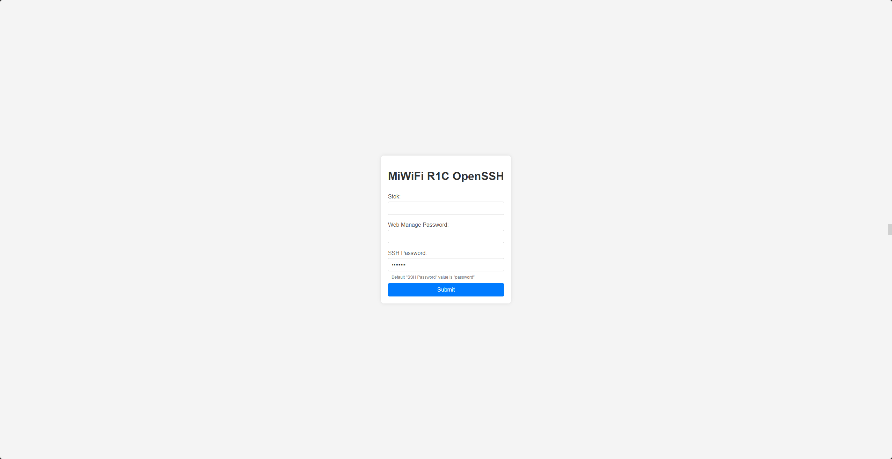

# MiWiFi R1C Mini 
> 用于开启R1C SSH的脚本，你需要有stok以及web管理密码，当然还得特定版本miwifi_r1cm_firmware_b9d56_2.7.11



## 怎么运行
> 如果无法正常安装库，请使用国内镜像，如清华源、163源、阿里源等...
``` bash
pip install <package> -i https://pypi.tuna.tsinghua.edu.cn/simple
```

- windows
``` bash
python -m venv venv 
venv\Script\activate
pip install requests flask 
python app.py
```
- linux
``` bash
python -m venv venv 
venv\bin\activate
pip install requests flask 
python app.py
```
启动后将会在本地启动一个web服务，默认地址为 http://127.0.0.1:5000

请勿关闭小黑窗！！！


## 怎么获得Stok
其实这个很简单，你在浏览路由器的管理界面时，Web的url已经明文携带了Stok，直接复制就行了。

## Files Download
- miwifi_r1cm_firmware_b9d56_2.7.11
